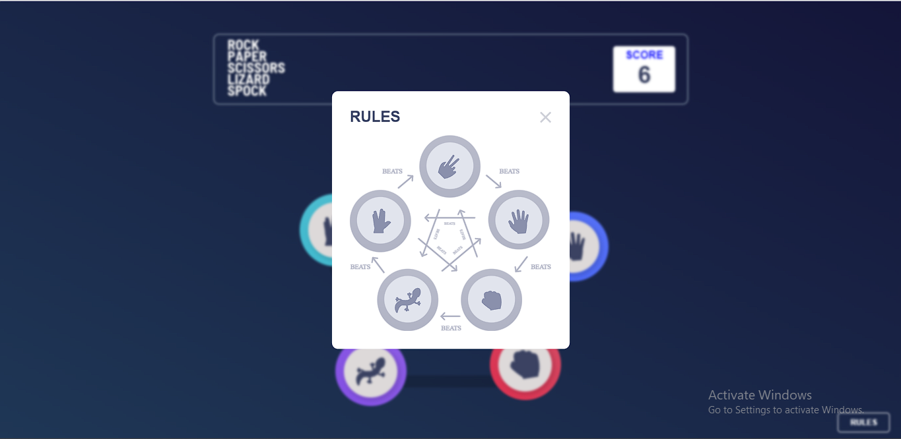
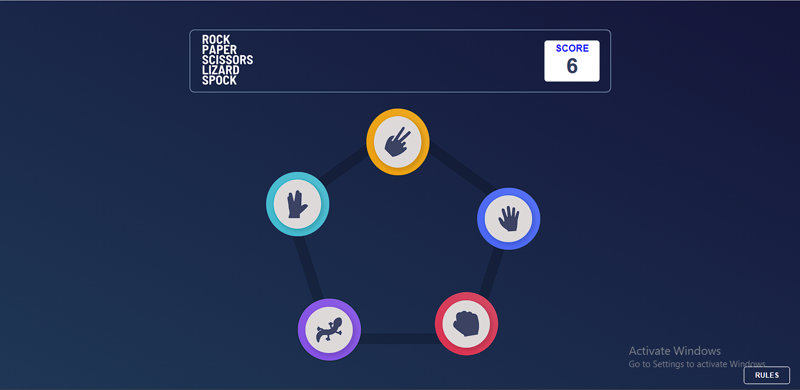
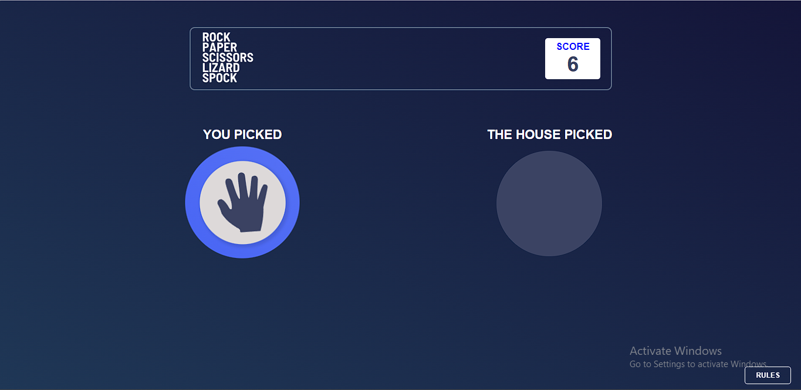
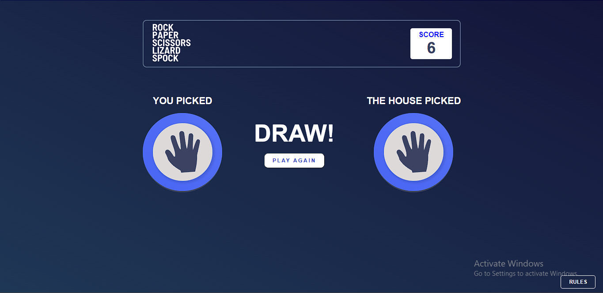

# Frontend Mentor - Rock, Paper, Scissors solution

This is a solution to the [Rock, Paper, Scissors challenge on Frontend Mentor](https://www.frontendmentor.io/challenges/rock-paper-scissors-game-pTgwgvgH). Frontend Mentor challenges help you improve your coding skills by building realistic projects.

## Table of contents

- [Overview](#overview)
  - [The challenge](#the-challenge)
  - [Screenshot](#screenshot)
  - [Links](#links)
- [My process](#my-process)
  - [Built with](#built-with)
  - [What I learned](#what-i-learned)
  - [Continued development](#continued-development)
- [Author](#author)

## Overview

### The challenge

Your challenge is to build out this Rock, Paper, Scissors game and get it looking as close to the design as possible.

You can use any tools you like to help you complete the challenge. So if you've got something you'd like to practice, feel free to give it a go.

Your users should be able to:

- View the optimal layout for the game depending on their device's screen size
- Play Rock, Paper, Scissors against the computer
- Maintain the state of the score after refreshing the browser _(optional)_
- **Bonus**: Play Rock, Paper, Scissors, Lizard, Spock against the computer _(optional)_

### Rules

If the player wins, they gain 1 point. If the computer wins, the player loses one point.

#### Original

- Paper beats Rock
- Rock beats Scissors
- Scissors beats Paper

#### Bonus

- Scissors beats Paper
- Paper beats Rock
- Rock beats Lizard
- Lizard beats Spock
- Spock beats Scissors
- Scissors beats Lizard
- Paper beats Spock
- Rock beats Scissors
- Lizard beats Paper
- Spock beats Rock

### Screenshot






### Links

- Solution URL: [Solution URL here](https://your-solution-url.com)
- Live Site URL: [Live site URL here](https://your-live-site-url.com)

## My process

### Built with

- Semantic HTML5 markup
- CSS custom properties
- Flexbox
- SCSS/SASS
- Desktop-first workflow
- Vanilla Javascript
- [Parcel]() - code bundling application used in minifying and reducing production file sizes.

### What I learned

I learnt a lot building my first game using javascript. I felt very happy after I finished building it, the logic aspect (javascript) was that much tough of a test. What actually tested my skill a little was the layout and mobile responsiveness. Most of the codes I wrote that I really appreciated were all in javascript. From the part where I imported some helper functions I wrote that helped in building this gamified web application.

```css
@mixin background($property) {
  border-radius: 100%;
  padding: 15px;
  position: absolute;
  cursor: pointer;
  width: 120px;

  @if $property == scissors {
    background: $scissorsGradient;
    top: 0;
    right: 190px;
    transform: translate(20px, -20px);
  } @else if $property == paper {
    background: $paperGradient;
    top: 0;
    transform: translate(40px, 130px);
    right: 0;
  } @else if $property == rock {
    background: $rockGradident;
    right: 0;
    transform: translate(-40px, 20px);
    bottom: 0;
  } @else if $property == lizard {
    background: $lizardGradient;
    bottom: 0;
    left: 0;
    transform: translate(30px, 30px);
  } @else if $property == spock {
    background: $spockGradient;
    top: 0;
    left: 0;
    transform: translate(-30px, 100px);
  }
}

%props-style--inner {
  width: 100%;
  border-radius: 100%;
  display: flex;
  justify-content: center;
  align-items: center;
  background-color: #ddd9d9;
  padding: 20px;
  box-shadow: 3px 3px 5px 3px rgba(0, 0, 0, 0.1);
}
```

```js
propContainer.addEventListener('click', function (e) {
  let randomAudio = randomizeProps(allBgAudio);
  audio(randomAudio);

  userPicked = e.target.dataset.prop;

  // hide current container
  propContainer.classList.add('hidden');

  // set the flex property of the body element
  body.classList.add('playerActive');

  let userSelected = document.querySelector(`.outer-container--${userPicked}`);

  userSelected.classList.add('mobile-outer--container');
  userSelected.firstElementChild.classList.add('mobile-inner--container');

  // append player1 selected item into container
  player1.appendChild(userSelected.cloneNode(true));

  // unhide to container to declare winner
  winnerDeclarator.classList.remove('hidden');

  setTimeout(() => {
    computerPicked = randomizeProps(allProps);
    let computerSelected = document.querySelector(`.outer-container--${computerPicked}`);

    computerSelected.classList.add('mobile-outer--container');
    computerSelected.firstElementChild.classList.add('mobile-inner--container');

    computer.appendChild(computerSelected.cloneNode(true));
    simulateResult();
  }, 2000);
});
```

### Continued development

I'm yet to attain the position where I want to get to, I'll keep aiming higher and getting better at what I do. I love coding🤩🤩

## Author

- Website - [Abdullah Ayoola](https://github.com/abdullah43577)
- Frontend Mentor - [@abdullah43577](https://www.frontendmentor.io/profile/abdullah43577)
- Twitter - [@officialayo540](https://twitter.com/officialayo540)
